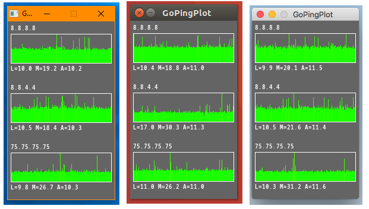

Go Ping Plot
============



Ping plotting app.

* Multi target, ping multiple hosts at once
* Line color changes with latency
* Multi OS, works on Windows, macOS and Linux
* Portable, self contained binaries
* Written in GoLang, uses SDL2

Usage
-----
```
gpp host [host [...]]

flags:
    -t - threshold for "bad ping" - line color will be more reddish  
```

Copyright
---------
Copyright 2019 Google LLC

Licenses
--------
* Go Ping Plot is Apache 2.0
* Uses SDL2 which is BSD-3-Clause
* Uses go-ping which is MIT
* Includes Google Noto Font which is SIL Open Font License, Version 1.1.
